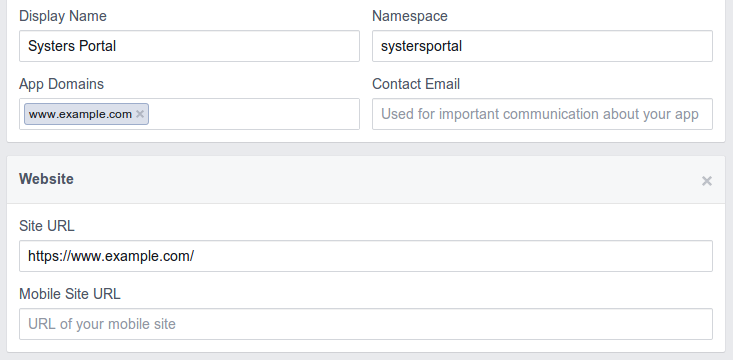
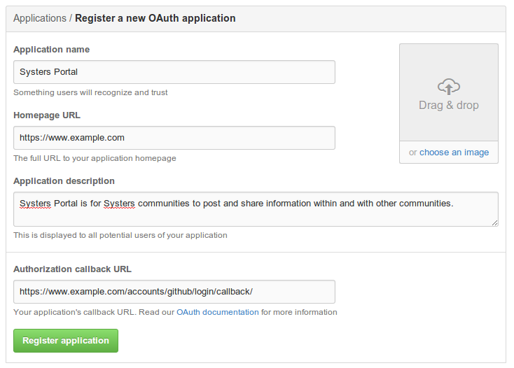
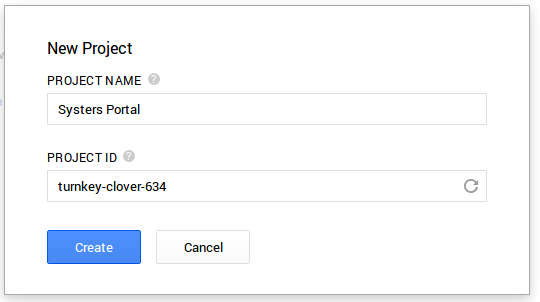
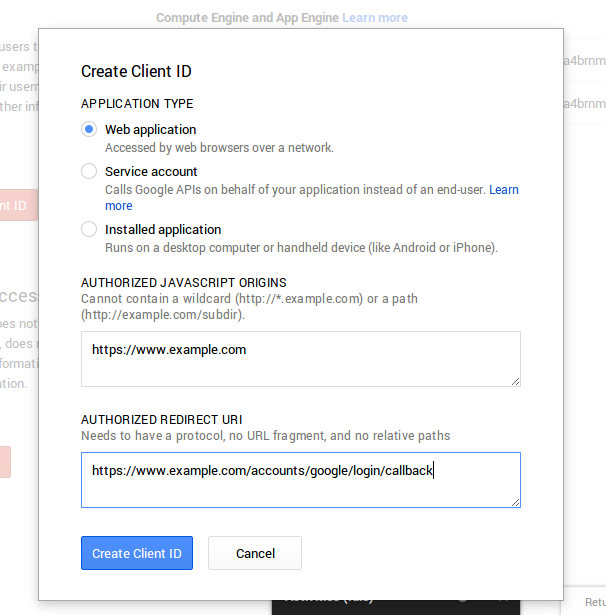
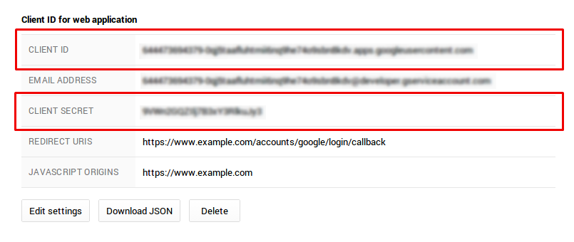
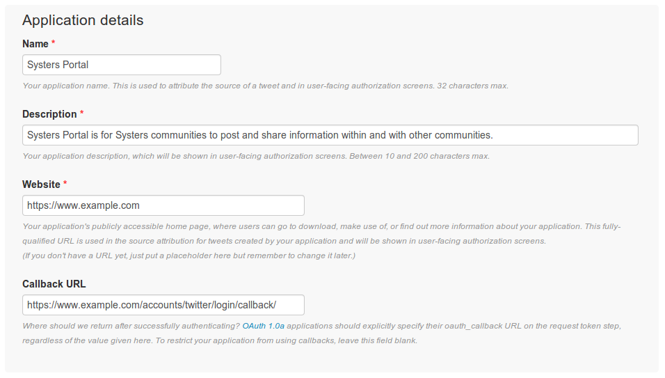
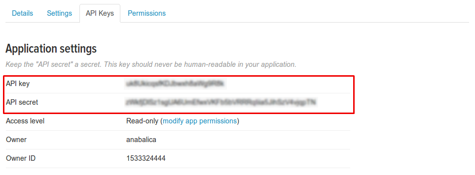

Configuration of social accounts
================================

Systers Portal offers the possibility of user authentication using local and
social accounts. There are 4 social apps available:

* facebook
* github
* google
* twitter

Each social app requires prior configuration. It is necessary to add a
*SocialApp* record per provider via the Django admin containing app credentials.
The process of configuration for each provider is described in detail below.

.. warning:: The providers' interface for generating API keys and client IDs
 might have changed slightly since this tutorial was written, but the general
 process should be the same.

.. note:: Throughout this tutorial https://www.example.com domain is used for
 demonstration purposes. It should be replaced with a real domain name, e.g.
 https://systers.org or http://localhost:8000 if developing on a local machine.

Facebook
--------
The following section describes the configuration of social login using Facebook
OAuth2. First signup as `Facebook developer`_. From the top toolbar go to *Apps* >
*Create a New App*. Fill the form, click *Create App*. Choose *Display Name*,
unique *Namespace* and category.

On the left sidebar of the app click on *Settings*. On *Settings - Basic* page
it is necessary to add a platform to the app. Select platform - *Website*. Set
*Site URL* to be https://www.example.com. Same domain name add to *Add Domains*.
Save changes.

If you are testing Facebook OAuth locally, then you can add http://localhost to
*App Domains* and http://localhost:8000 to *Site URL*. It won't work, if you use
loopback IP address 127.0.0.1 instead of localhost.

On the *Dashboard* page you can find the App ID and App Secret. Go to Systers
Portal and create a new social app at
https://www.example.com/admin/socialaccount/socialapp/add/. Select
*Facebook* provider, choose a suggestive name (e.g. *Facebook OAuth2*), copy the
App ID and the App Secret to the *SocialApp* record. Choose the available sites
for which to enable the social auth with Facebook and hit Save.

To test if Facebook social auth using OAuth2 is configured properly, go to
https://www.example.com/accounts/login/ and try to login using Facebook. You will
be asked to authorize the application and will be redirected to a page to enter
your username and email that you want to use for login.

Github
------
Register a new oAuth application at https://github.com/settings/applications/new.
Fill the form. Enter the *Homepage URL* - https://www.example.com. The *Authorization*
*callback URL* should be of the form::

    https://www.example.com/accounts/github/login/callback/

Immediately after you will be redirected to the Application dashboard to access
the newly generated Client ID and secret. Create a new social app for Systers
Portal at https://www.example.com/admin/socialaccount/socialapp/add/. Select
*Github* provider, choose a suggestive name (e.g. *Github OAuth*), copy the
Client ID and the secret to the *SocialApp* record. Choose the available sites
for which to enable the social auth with Github and hit Save.

To test if Github social auth is configured properly, go to
https://www.example.com/accounts/login/ and try to login using Github. You will
be asked to authorize the application and will be redirected to a page to enter
your username and email that you want to use for login.

Google
------
The Google provider is OAuth2 based. More on using OAuth2 to access Google APIs:
https://developers.google.com/accounts/docs/OAuth2

Go to `Google Developers Console`_ and create a new project. A window will pop up
for you to fill in project information. Enter a suggestive name for the new
project (e.g. *Systers Portal*), let the system generate a unique project ID and
click *Create*.

Right after the project will be created, you will be redirected to Project
Dashboard. Click on *Enable an API* button. On the left sidebar in the section
*APIs & AUTH* access *Credentials* page. A popup will appear to enter details
to create a client ID. Choose *Web application*. For *Authorized Javascript Origins*
enter the website domain name. In *Authorized Redirect URI*, type the
`development callback URL`_, which must be of the form::

    https://www.example.com/accounts/google/login/callback

The system will generate a client ID and a secret for the following web
application.

Create a new social app for Systers Portal at
https://www.example.com/admin/socialaccount/socialapp/add/. Select *Google*
provider, choose a suggestive name (e.g. *Google OAuth2*), copy the Client ID
and the Client Secret from Google Developer Console to the *SocialApp* record.
Choose the available sites for which to enable the social auth with Google and
hit Save.

To test if Google social auth is configured properly, go to
https://www.example.com/accounts/login/ and try to login using Google.

Twitter
-------
Go to `Twitter Apps`_ page and create a new app. Fill the form. Enter the
*Website* - https://www.example.com. The *Callback URL* should be of the form::

    https://www.example.com/accounts/twitter/login/callback/

On the Application Management page of Systers Portal, access the *API keys* tab.
It contains the API key and API secret necessary to enable authentication with
twitter.

Create a new social app for Systers Portal at
https://www.example.com/admin/socialaccount/socialapp/add/. Select *Twitter*
provider, choose a suggestive name (e.g. *Twitter OAuth*), copy the
API key and the API secret to the *SocialApp* record. Choose the available sites
for which to enable the social auth with Github and hit Save.

To test if Twitter social auth is configured properly, go to
https://www.example.com/accounts/login/ and try to login using Twitter. You will
be asked to authorize the application and will be redirected to a page to enter
your username and email that you want to use for login.

.. _Facebook developer: https://developers.facebook.com/
.. _Google Developers Console: https://console.developers.google.com
.. _development callback URL: http://django-allauth.readthedocs.org/en/latest/#google
.. _Google OAuth docs: https://developers.google.com/console/help/new/#generatingoauth2
.. _Twitter Apps: https://apps.twitter.com/
