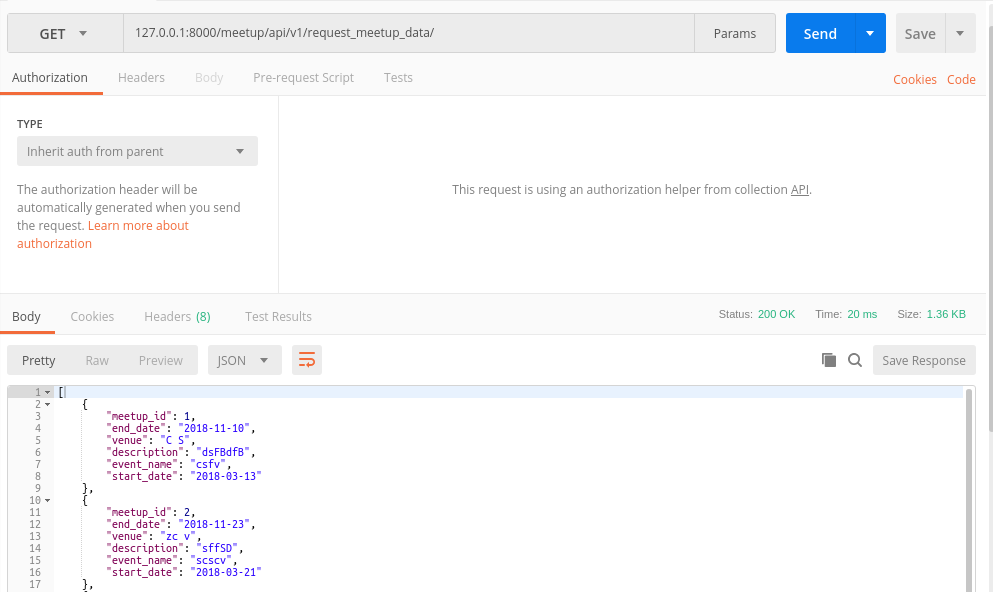

Api to communicate with VMS
===========================
The purpose of building this API was to provide information about the meetups
in Portal to VMS so that their volunteers could participate in them. Presently,
there are three fields of meetups which are sent to VMS via the API::

1. Event Name - Title of the event going to be held.
2. Start Date - The date from which the event would start.
3. Venue - The location of the event.

Users can send in a ``GET`` or a ``POST`` request to `https://localhost/meetup/api/v1/request_meetup_data/ <https://localhost/meetup/api/v1/request_meetup_data/>`_ to access the meetup data.

In case of a ``GET`` request, a list containing the details of all meetups
in the ascending order of their dates will be returned :

In case of a ``POST`` request,a list containing the details of all meetups 
occurring after the date value sent in the request object will be returned :

.. image:: ../_static/POST_request.png
   :align: center

Details of the API
------------------

1. Use Case : Send event details for volunteers to contribute accordingly.

2. API Method : GET/POST

3. URL Parameters : ``https://localhost/meetup/api/v1/request_meetup_data/``

4. Request Body::

      {
        "Date” : “date after which all meetups are required (yyyy-mm-dd)”
      }

5. Response Body - Success::

      {
        “Event Name/Title” : “ --------”
        “Start Date” : “-----------”
        “Venue” : “------------------”
      }

6. Response Body - Error::

      {
        "message": "Please input a proper date"
      }
